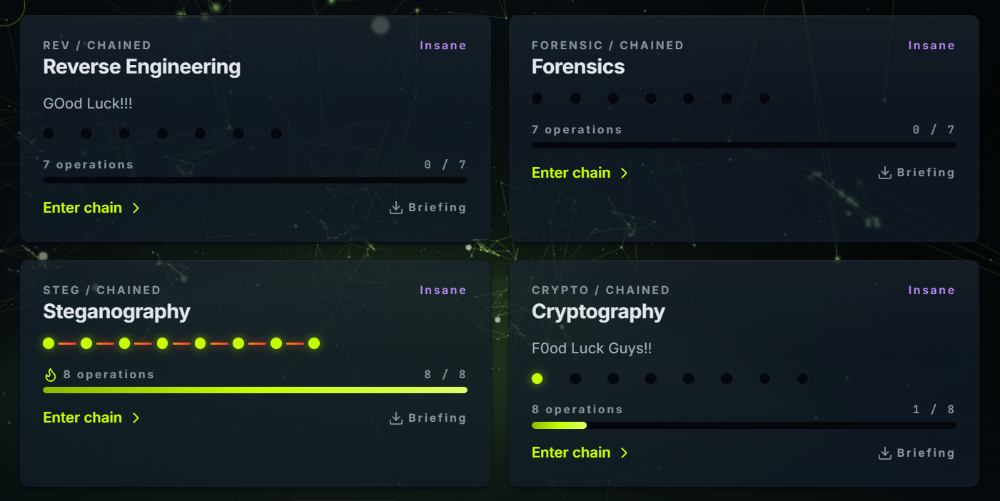
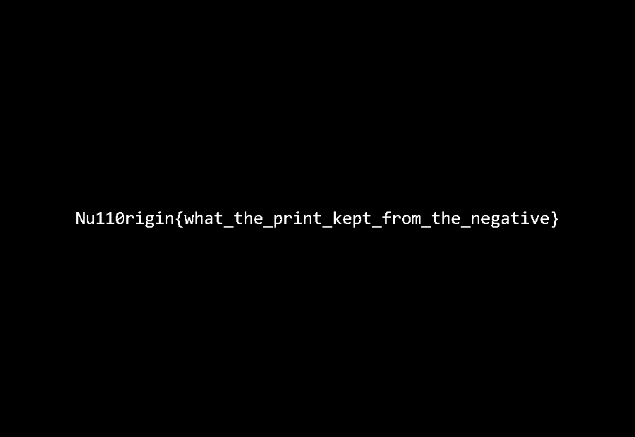
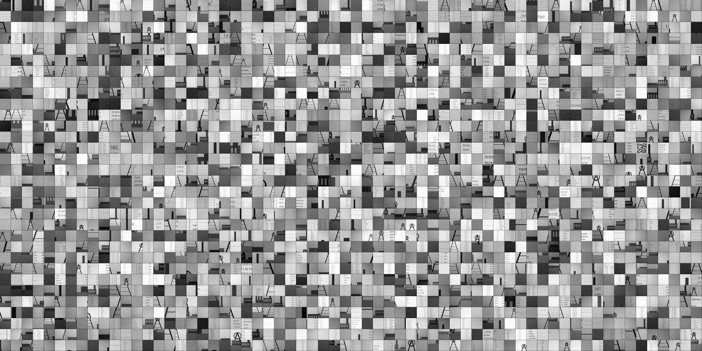
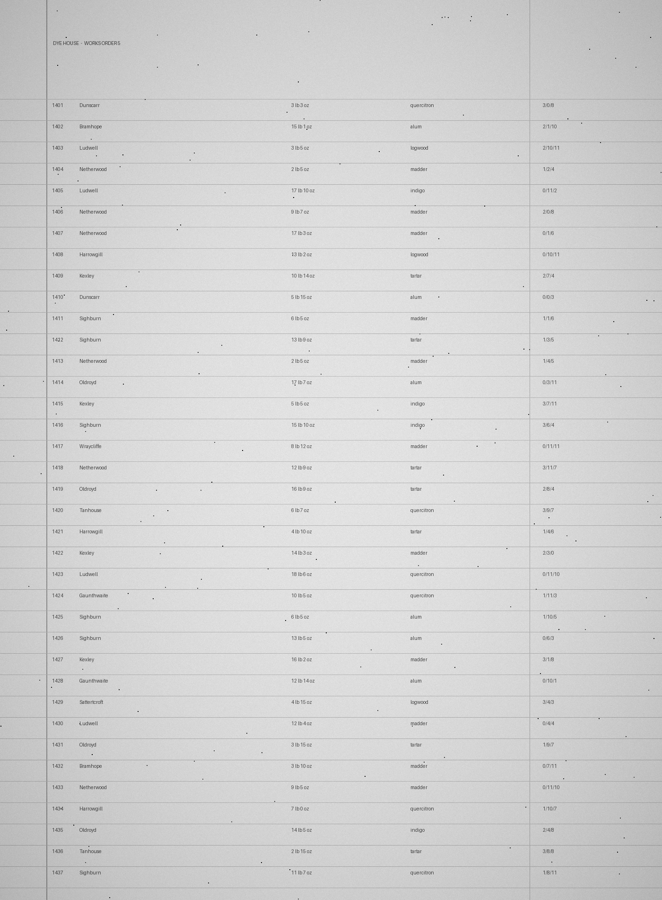

Im main ~~Cryptography~~ Stegography



Idk, this is one of the first contest I have passion on this category. ~~Crypto chain is being cursed with pwn and rev 🍊~~

# About Stego Chain (README)
```
Null0rigin - STEGO CHAIN
========================

Eight stages, in order:

  31-driftwood   32-safelight   33-moire       34-undertone
  35-pentimento  36-winnow      37-mordant     38-quietus

Each folder ships its carrier(s) plus one document. Read it.

No verify binary. The previous stage's flag is the key to the next one.
Wrong key -> nothing, no partial credit, no signal. Copy each flag exactly,
braces included.

Some carriers do not survive being re-saved or re-encoded. Keep an
untouched copy of everything. SHA256SUMS.txt tells you if a file changed.

FLAG FORMAT
  Null0rigin{lowercase_words_with_underscores}

Start at 31-driftwood.
```

# 31 - driftwood
> plate-card.txt


From the description in the `plate-card.txt`, we know that the biggest hint is PL8. 

Besides that, if we inspect about the RGBA channel of this image. Most of its alpha value is 255 while the first column contains 254 and 255. Thus, I extract the MSB and group every 8-bit together. We will get :
```
50 4c 38 01 3a 00 eb c2 a0 ba ...
P  L  8
```

From this point, we just follow the PL8 signature : 
```
50 4c 38       -> "PL8"
01             -> issue 1
3a 00          -> length = 0x003a = 58 bytes
eb c2 a0 ba    -> payload = 0xBAA0C2EB
```

Got the payload, now just need to convert them into byte and we got :
```
b'Null0rigin{what_the_negative_kept_from_the_print}\x1f\x9eL\x1a\xf0\xd3\xb2vQ'
```

# 32 - safelight
> keycard.txt


From two images, I check that if they are actually perfect inverted with `print_pixel == 255 - negative_pixel`

With `d = print_pixel - (255 - negative_pixel)`, we see these value : `0 3 -1 1`
- 0 : ordinary image
- 3 : a very fake-flag image, very good decoys lol

- -1 and +1 : actual bit we need. In this, I let -1 being 0 and +1 being 1. 

Thus, we'll get :
```
e1 c3 92 c8 74 74 3a b5 4c c0 ...
```

From this point, we just need to follow the instruction in `keycard.txt` :
```
k = SHA256(
    b"Null0rigin{what_the_negative_kept_from_the_print}"
)
> e25693cd804a819d8638171adf44e60f...
```

The stream : 
```
SHA256(k || 00000000)
SHA256(k || 00000001)
SHA256(k || 00000002)
...
```

XOR them with the bytes we found before :
```
50 4c 38 01 3c 00 a1 8b c2 58 ...
 P  L  8
```

The rest is similar to the `31 - driftwood` :
```
b'Null0rigin{two_cells_of_equal_weight_are_not_equal}\x1f*w\xbe\x05\xc4\x19\x8d?'
```

# 33 - moire
> screen-notes.txt


From `screen-notes.txt`, we get the idea : split the image into small boxes, then somehow figure the pattern to divide them into bits. 

From `moirce.png`, we get the size : 
```
256 × 192 cells
each cell = 4 × 4 pixels
```

After a while testing, I found that :
```
weight 4-   -> 1 pattern
weight 5   -> 2 patterns   <-- data
weight 6   -> 2 patterns   <-- data
weight 7   -> 2 patterns   <-- data
weight 8   -> 2 patterns   <-- data
weight 9   -> 2 patterns   <-- data
weight 10  -> 2 patterns   <-- data
weight 11  -> 2 patterns   <-- data
weight 12+ -> 1 pattern
```

Thus, we can guess that weight from 5 to 11 will contain the data we need, but we not know yet if it is 0 or 1. Luckily, there are only 7 pattern, so that only 2 ^ 7 = 128 possible assignment. I test all of them with the similar decryption from the previous challs and found :
```
b'Null0rigin{a_carrier_laid_across_the_whole_room}\x1f\xf1\t\x83\xddk^\xc4\xa2
```

# 34 - undertone
> line-notes.txt

> linetest.wav

> undertone.wav

A spectrum stegography. Again, the note `line-notes.txt` guide us very well. 

With `linetest.wav` having known the plain text. I guess the `1 encoded bit = 2048 audio samples`

Then we can extract the stream bit (reverse the chall #32) : 
```
k = SHA256(key_string)

stream =
    SHA256(k || 00000000)
 || SHA256(k || 00000001)
 || SHA256(k || 00000002)
 || ...

stream bit 0 -> -1
stream bit 1 -> 1
```

Now we can actually calculate the bit from the score `score = sum(audio_sample[i] * spreading_chip[i])` :
```
score > 0 -> message bit 1
score < 0 -> message bit 0
```

Test with `linetest.wav` :
```
SHA256("LINE TEST")
b'PL8\x01\x1b\x00}\x01O\xc1NULL0RIGIN LINE TEST 1 OF 1\xec*\x8d@!\x91'
```

Thus, the flag is :
```
b'Null0rigin{the_order_of_the_colours_is_the_message}\x1fU\xc2\xe7\x91@\xab=\x08'
```

# 35 - pentimento
> dish-notes.txt


A gif now! This gif contains :
```
11 frames
480 × 360
256-entry local palette on every frame
```

At first, im a bit lost since this is the time im playing with .gif. But again, thanks to `dish-notes.txt` : 
```
darkest to lightest, by the plain reckoning, red before green before blue
```

Now, we have known the order. Just arrange them and we can get the flag.
Pattern : 
```
key = (R + G + B, R, G, B)

palette[0], palette[1]
palette[2], palette[3]
...
palette[254], palette[255]
```
Notes that bit 0 is for the pair that follow the order and bit 1 is for the reverse-pair

Thus we got the bytes :
```
76 86 a3 5c 04 04 84 76 e8 80 39 1a ...
```
which is :
```
b'Null0rigin{keep_the_grain_and_burn_the_chaff}\x1f\xbd?`\xa8\xe2t\x9c\x15'
```

# 36 - winnow
> contact-sheet.txt



`contact-sheet.txt` already hint us : 2024 frames split into 64x32, process in pair and each frames carries a candidate and a short authentication "seal"/

The last flag gives us a hint so we just need to process `32x32 pixels` tho the image size is `2048x1024 pixels`

A frame contains :
```
[data_bit][16 seal bits]
```
then we can easily calculate the `seal`

Lastly, we process the same as previous challs and get :
```
b'PL8\x014\x00\xcdh\xea:Null0rigin{nothing_takes_until_it_is_fixed}\x1f\x07\xe5\xcb2\x19\xd6\xf4\x8b1'
```

# 37 - mordant
> mordant-notes.txt



In the `mordant-notes.txt`, its saying that we will use 5 type scanline with the fifth being the duplication for first. Thus, we have :
```
filter 0:  64 lines
filter 1: 456 lines
filter 2: 504 lines
filter 3: 453 lines
filter 4: 423 lines
```

I tried : 
```
PNG filter 0 -> 00
PNG filter 1 -> 01
PNG filter 2 -> 10
PNG filter 3 -> 11
PNG filter 4 -> 00

[line0][line1][line2][line3]
   2      2      2      2 bits
```

and get this 
```
8a 49 64 13 72 89 36 14 65 6a f1 41 a0 12 a5 8a ...
```

AFter xoring with the previous flag, I decrypt and get nothing. Struggle for a bit and found out this line : `the card's key opens the page. The six open what is on it`

Thus, I find six 8-byte mordant pieces from the previous challs :
```
31  9e4c1af0d3b27651
32  2a77be05c4198d3f
33  f10983dd6b5ec4a2
34  55c2e79140ab3d08
35  bd3f60a8e2749c15
36  07e5cb3219d6f48b
```

After concatenate them and hashing, I get : 
```
50 4c 38 01 2f 00 30 2d eb 29 ...
P  L  8
```

Thus, the flag is :
```
b'PL8\x01/\x000-\xeb)Null0rigin{he_set_two_sorts_where_one_would_do}\x94mJ2/p\xe8Uk1\x17\xf8\x14\xee\x06@)B\x8b\xd0\xfa\x083'
```

# 38 - quietus
> press-notes.txt


The `press-notes.txt` maps almost directly onto DEFLATE terminology: 
- `set it fresh` means emit a literal
- `reach back` means emit a length/distance back-reference
- a `ligature` is always exactly three characters;
- and when a back-reference is used, it must point to the nearest matching occurrence.

Struggle a bit long for this chall, here is the short explanation :

The `press-notes.txt` also indicate that 
```
THREE CHARACTERS MAKE A LIGATURE. Never two, never four
```
and 
```
always reached for the nearest one
```

Thus, every position, we are looking for if the next 3 output can represented by a previous matching 3-byte sequence ?
- If not, ignores
- IF yes :
```
literal emitted       -> 0
length-3 match emitted -> 1
```

I get about `38423 choice bit` : 
```
16 76 88 6a 53 94 05 ef ff da 4a 69 c5 04 f8 89 ...
```

Decrypt normally (in this series) : 
```
Null0rigin{the_channel_closes_from_the_inside}
```

# Some yapping 
Thank you very much if you reach this. I dont expect you can understand this but I hope this WUs can help you imrpove your steg skill.